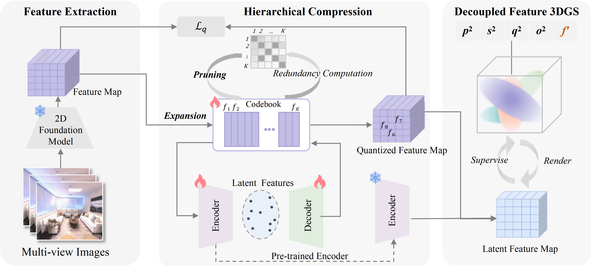

# Efficient Decoupled Feature 3D Gaussian Splatting via Hierarchical Compression

 

<!-- <section class="section" id="BibTeX">
  <div class="container is-max-desktop content">
    <h2 class="title">BibTeX</h2>
    <pre><code>@inproceedings{zhou2024feature,
  title={Efficient Decoupled Feature 3D Gaussian Splatting via Hierarchical Compression},
  author={Dai, Zhenqi and Liu, Ting and Zhang, Yanning},
  booktitle={Proceedings of the IEEE/CVF Conference on Computer Vision and Pattern Recognition},
  pages={},
  year={2025}
}</code></pre>
  </div>
</section> -->

# Environment
The environment for our project is similar to that of our main baseline [Feature_3DGS](https://feature-3dgs.github.io/).

```shell
conda create --name df_3dgs python=3.8
conda activate feature_3dgs

pip install torch==2.0.1+cu118 torchvision==0.15.2+cu118 --index-url https://download.pytorch.org/whl/cu118

pip install -r requirements.txt
```
# dataset structure

```
<location>
|---images
|   |---<image 0>
|   |---<image 1>
|   |---...
|---test_images
|   |---<image 0>
|   |---<image 10>
|   |---...
|---train_images
|   |---<image 5>
|   |---<image 15>
|   |---...
|---sparse
    |---0
        |---cameras.bin
        |---images.bin
        |---points3D.bin
```

# LSeg encoder
Download the LSeg model `demo_e200.ckpt` from [the Google drive](https://drive.google.com/file/d/1ayk6NXURI_vIPlym16f_RG3ffxBWHxvb/view?usp=sharing) and put it to `lseg_encoder/checkpoint`.

# Run
For detailed steps, please refer to the `commet.sh` file.

## Acknowledgement
Our repository is developed based on the excellent work of the following open-source projects:[Feature_3DGS](https://feature-3dgs.github.io/), [LangSplat](https://langsplat.github.io/),[gsplat](https://github.com/nerfstudio-project/gsplat),[3D Gaussian Splatting](https://repo-sam.inria.fr/fungraph/3d-gaussian-splatting/). We would like to extend our sincere gratitude to the authors for making their codebases available to the public.
